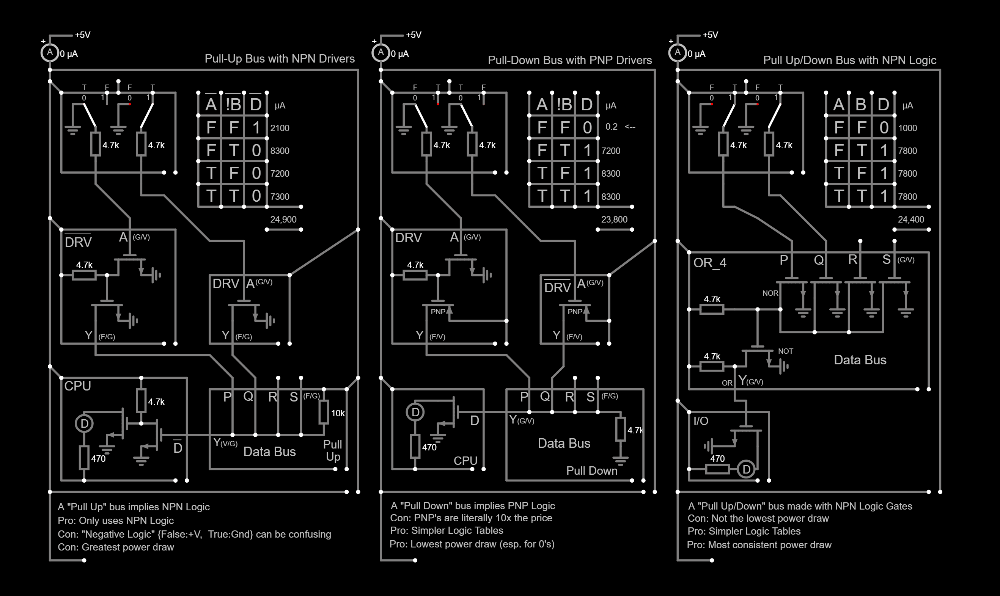
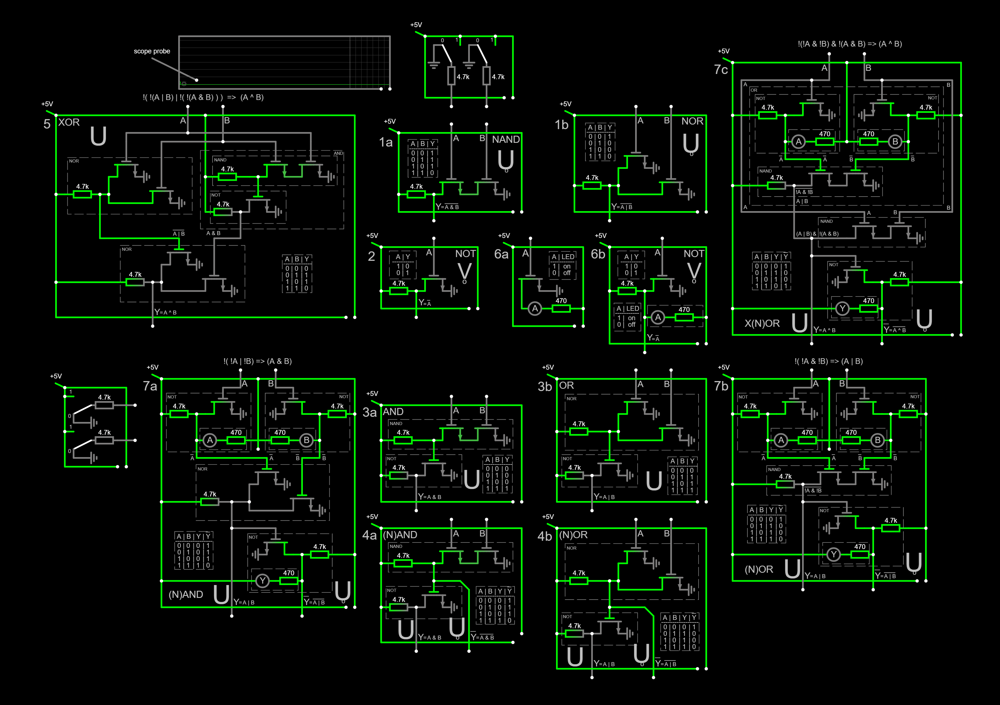

Open thes files with https://www.falstad.com/circuit/circuitjs.html 
Download Falstad for offline use here: https://www.falstad.com/circuit/offline/ 
 
File -&gt; Open 
 
 
 
 
Set "Simluation Speed" low to reduce CPU overhead 
Set "Current Speed" high to see the dots moving 
 
Drag the scope probe anywhere you like to monitor a gate 
 
Tap "w" to enter "draw wire" mode, then connect the switches (top and left) to any gate you wish. 
Click in the middle of a switch to toggle between 1 and 0 