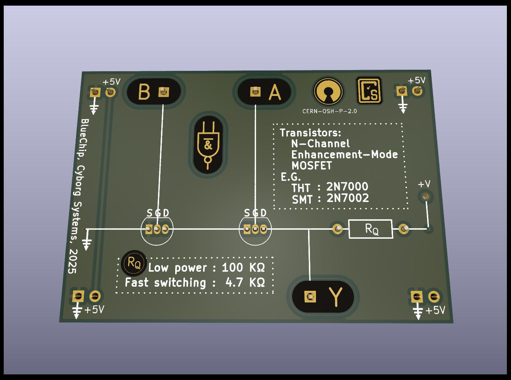
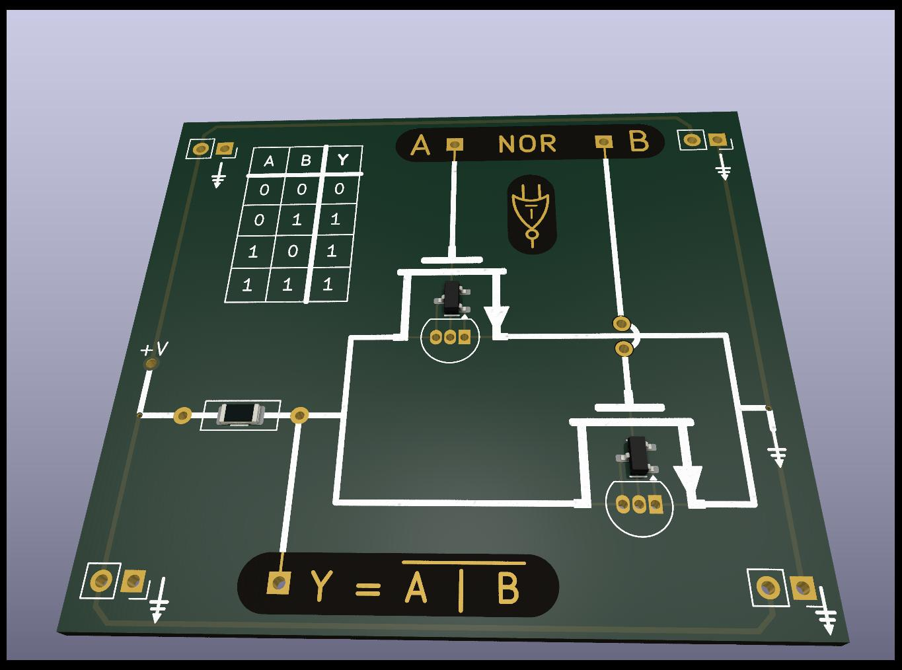
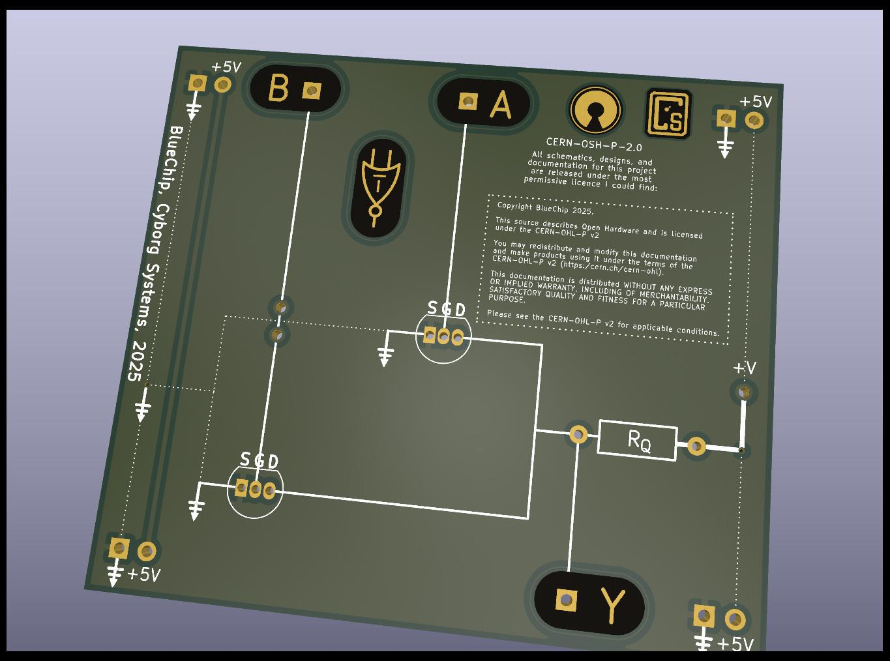
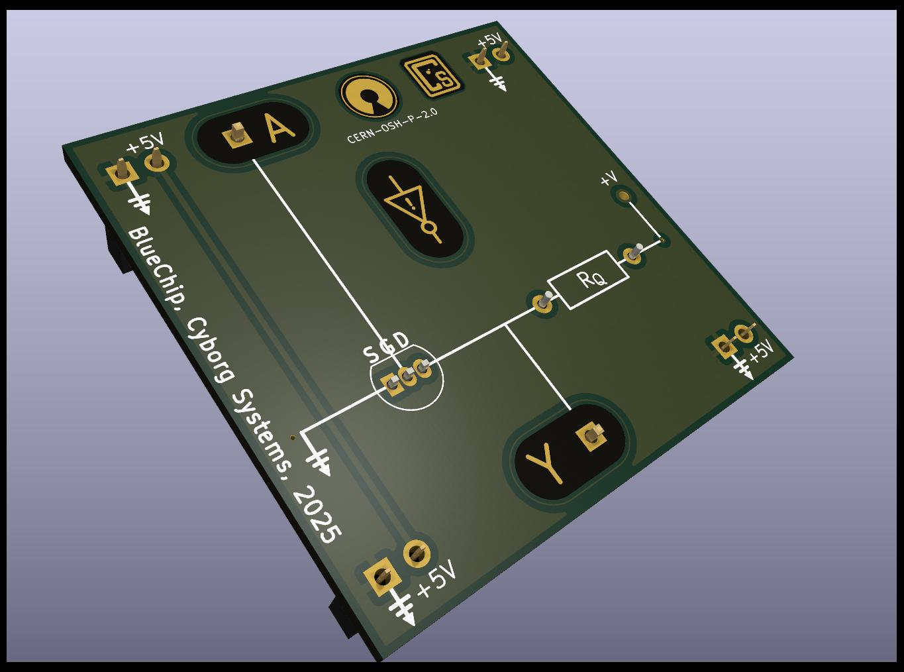
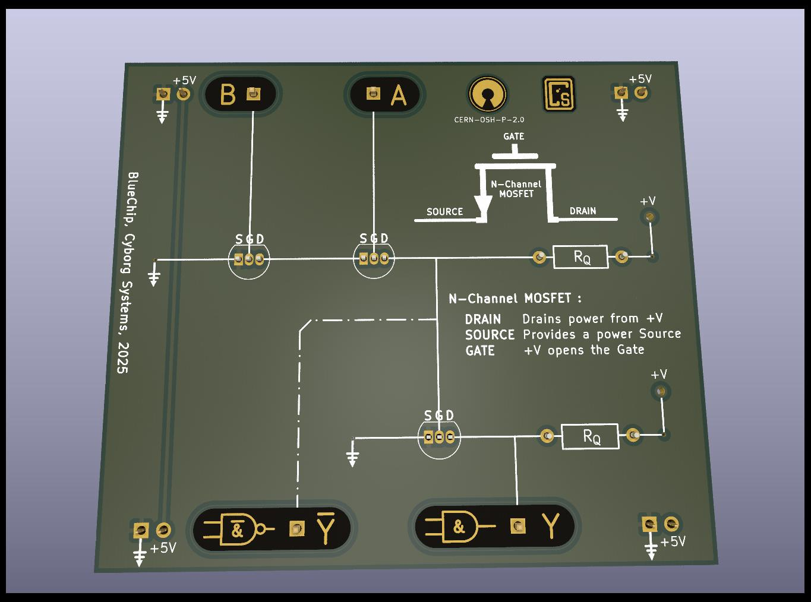

&nbsp;&nbsp;&nbsp; 
&nbsp;&nbsp;&nbsp; 
&nbsp;&nbsp;&nbsp; 
&nbsp;&nbsp;&nbsp; 
&nbsp;&nbsp;&nbsp; 
&nbsp;&nbsp;&nbsp; 

&nbsp;&nbsp;&nbsp; 
&nbsp;&nbsp;&nbsp; 
&nbsp;&nbsp;&nbsp; 
&nbsp;&nbsp;&nbsp; 

